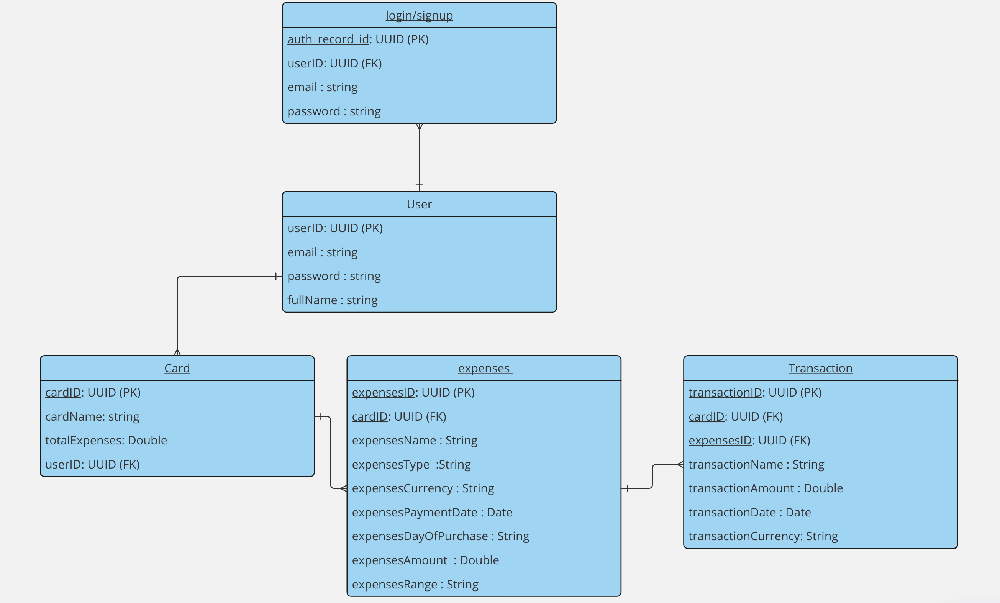

  # Wasilaah App 

**APP INTRODUCTION.**

## **APP INTRODUCTION.**

Introducing **Wasilaah**, the innovative application designed specifically for startup founders facing the challenge of securing a company credit card. In today’s fast-paced business environment, managing finances efficiently is crucial for growth and stability. Wasilaah revolutionizes this process by enabling founders to easily document work-related expenses on their personal cards. This not only streamlines financial tracking but also enhances the awareness of business finances, allowing leaders to make informed decisions and reduce manual workload. Embrace the power of simplicity and focus on what truly matters—growing your business. Wasilaah is here to ensure your financial management is as dynamic and agile as your startup.

App Statement

## **APP STATEMENT.**

An application that helps founders of startups.
Who are struggling to get a credit card for their company quickly.
By creating an app, easily document their work-related expenses in their personal card.
So they can increase their awareness of the finances of their business and reduce their manual work.

APP FEATURES

## **APP FEATURES.**
* Easy Recording and Documentation
* Defining Budgets
* Multiple Card Analysis
* Alerts

Tables

## **TABLES.**

1-login/signup Table 

|        Column       |      TYPE     |     Key
|--------------------:|--------------:|---------------|
|   auth_record_id    |     uuid      |      PK       |
|   userID            |     uuid      |      FK       |
|   email             |    String     |               |
|   Password          |    String     |               |

2-User Table 

|        Column       |      TYPE     |     Key
|--------------------:|--------------:|---------------|
|   userID            |     uuid      |      PK       |
|   fullName          |    String     |               |
|   email             |    String     |               |
|   password          |    String     |               |

3-Card Table 

|        Column       |      TYPE     |     Key
|--------------------:|--------------:|---------------|
|   cardID            |     uuid      |      PK       |
|   userID            |     uuid      |      FK       |
|   cardName          |    String     |               |
|   totalExpenses     |    Double     |               |

4-Expenses Table 

|        Column       |      TYPE     |     Key
|--------------------:|--------------:|---------------|
|   expensesID        |     uuid      |      PK       |
|   cardID            |     uuid      |      FK       |
|   expensesName      |    String     |               |
|   expensesType      |    String     |               |
|   expensescurrency  |    String     |               |
| expensesPaymentDate |    Date       |               |
|expensesDayOfPurchase|    String     |               |
|   expensesAmount    |    Double     |               |
|   expensesRange     |    String     |               |

5-Transaction Table 

|        Column       |      TYPE     |     Key
|--------------------:|--------------:|---------------|
|   transactionID     |     uuid      |      PK       |
|   cardID            |     uuid      |      FK       |
|   expensesID        |     uuid      |      FK       |
|   transactionName   |    String     |               |
|   transactionAmount |    String     |               |
|   transactionDate   |    Date       |               |
| transactioncurrency |    String     |               |

Database Schema

## **DATABASE SCHEMA.**

  

RelationShip

## **RELATIONSHIP.**
  
### One-To-Many (1:M) Relationship.

**One User can have a Many logIn/SignUp.**

**One user can have a group of Cards.**

**One Card can have a group of Expenses.**

**One Expense can have a group of Transaction.**

